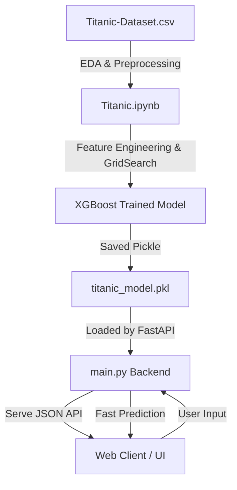

# 🚢 Titanic Survival Predictor (FastAPI + XGBoost + Glassmorphism UI)
> **مشروع متكامل لتوقع فرصة النجاة من كارثة تيتانيك باستخدام الذكاء الاصطناعي وواجهة مستخدم عصرية.**

---

## 🌍 Introduction / مقدمة عن المشروع

### 🇬🇧 English
On April 15, 1912, the luxury passenger liner RMS Titanic sank after colliding with an iceberg, resulting in the tragic deaths of 1502 out of 2224 passengers and crew. This classic machine learning project analyzes the historical passenger manifest to discover patterns among those who survived and those who did not, building a high-accuracy predictive model using **XGBoost** and exposing it through a modern, beautiful **FastAPI** web application.

### 🇸🇦 العربية
في 15 أبريل 1912، غرقت السفينة الأسطورية "تيتانيك" بعد اصطدامها بجبل جليدي، مما أدى إلى وفاة 1502 من أصل 2224 راكباً وملاحاً. هذا المشروع هو تطبيق عملي متكامل لعلوم البيانات وتعلم الآلة، حيث يقوم بتحليل بيانات ركاب السفينة التاريخية لاستخلاص الأنماط والخصائص التي حددت فرص نجاة الركاب، وبناء نموذج تنبؤي فائق الدقة باستخدام خوارزمية **XGBoost**، مع تقديم الخدمة عبر واجهة ويب تفاعلية وتصميم زجاجي (Glassmorphism) مذهل باستخدام **FastAPI**.

---

## 🛠️ Project Architecture / بنية المشروع

The project is structured into three main layers:
1. **Data Science & ML Pipeline (`Titanic.ipynb`)**: Performs Exploratory Data Analysis (EDA), missing value imputation, advanced feature engineering, hyperparameter tuning with `GridSearchCV`, and model serialization.
2. **Backend API (`main.py`)**: Built with **FastAPI**, serving high-performance, robust, type-safe validation (using **Pydantic**) for single and batch predictions.
3. **Premium Web Interface (`static/`)**: A state-of-the-art Single Page Application (SPA) designed with absolute visual excellence. Features glassmorphism cards, glowing ambient light orbs, CSS keyframe micro-animations, and full mobile responsiveness.



---

## 📊 Feature Engineering / هندسة الخصائص

Advanced feature engineering was performed in the notebook to extract highly predictive features from the raw dataset, replacing low-value metadata:

| Feature Name | Type | Description / الوصف | Transformation |
| :--- | :--- | :--- | :--- |
| **Pclass** | Categorical | Ticket class (1st, 2nd, 3rd) | Encoded & Scaled |
| **Sex** | Categorical | Passenger gender | Label Encoded (0: Female, 1: Male) |
| **Age** | Numerical | Fractional age of the passenger | Imputed with Median |
| **AgeBand** | Categorical | Age categorized into groups | `0: Child (0-12)`, `1: Teen (12-18)`, `2: Young Adult (18-35)`, `3: Adult (35-60)`, `4: Senior (60+)` |
| **Title** | Categorical | Title extracted from passenger names | Grouped into `Mr`, `Miss`, `Mrs`, `Master`, `Rare` |
| **FamilySize** | Numerical | Combined family count on board | `SibSp + Parch + 1` |
| **IsAlone** | Binary | Whether the passenger traveled solo | `1` if `FamilySize == 1` else `0` |
| **Fare** | Numerical | Passenger fare ticket price | Imputed with Median |
| **FareBand** | Categorical | Fare categorized into quartiles | 0 to 3 based on pandas `qcut` |
| **Embarked** | Categorical | Port of embarkation | `C: Cherbourg`, `Q: Queenstown`, `S: Southampton` |

### Key Preprocessing Strategies:
* **Handling Missing Values:** Missing ages and fares are filled with their median values to maintain robust statistics. Missing embarkation values are filled with the mode (`S`).
* **Title Extraction:** Extracted prefix titles (e.g., *Mr, Mrs, Miss, Master, Dr, Rev*) from names. Rare status titles were consolidated into `Rare` to prevent overfitting.
* **Data Leakage Protection:** Feature scaling using `StandardScaler` was fit strictly on the training partition and then applied to both train and test partitions.

---

## 📈 Model Performance & Hyperparameters / أداء النموذج ودقة التنبؤ

We leveraged the powerful **XGBoost Classifier** algorithm, which uses gradient boosted decision trees to achieve outstanding accuracy on tabular datasets.

### Hyperparameter Tuning:
Using `GridSearchCV` with 5-Fold Stratified Cross-Validation, the best hyperparameter configuration found was:
```python
{
    'colsample_bytree': 0.8,
    'learning_rate': 0.1,
    'max_depth': 5,
    'n_estimators': 200,
    'subsample': 1.0
}
```

### Evaluation Metrics:
* **Baseline CV Accuracy:** `81.89%`
* **Optimized GridSearch CV Accuracy:** `83.43%`
* **Holdout Test Set Accuracy:** `83.24%`

#### Classification Report (Test Set):
```text
              precision    recall  f1-score   support

Not Survived       0.85      0.88      0.87       110
    Survived       0.80      0.75      0.78        69

    accuracy                           0.83       179
   macro avg       0.83      0.82      0.82       179
weighted avg       0.83      0.83      0.83       179
```

* **Top Feature Importance:** The passenger's **Sex** is overwhelmingly the most dominant feature determining survival, followed by **Pclass** and **Passenger Title**, honoring the classic "women and children first" maritime protocol.

---

## 💻 Technical Stack & Tech Specifications / التقنيات المستخدمة

- **Machine Learning & Analysis:** Python, Jupyter Notebook, Pandas, NumPy, Scikit-Learn, XGBoost, Matplotlib, Seaborn, Joblib.
- **Backend API:** FastAPI, Uvicorn, Pydantic, CORS Middleware.
- **Frontend App:** Semantic HTML5, Vanilla CSS3 (Custom Glassmorphism theme, CSS Variables, Fluid Animations, Flexbox/Grid Layouts), Vanilla JavaScript (Async API calls, dynamic DOM manipulation, status-aware UI rendering).

---

## 🚀 Getting Started & Installation / طريقة التشغيل والتركيب

Follow these steps to run the Titanic Survival Predictor on your local machine:

### 1. Prerequisites
Ensure you have Python 3.10+ installed.

### 2. Clone and Setup Environment
Navigate to the project root directory and create a virtual environment:
```bash
# Create virtual environment
python -m venv .venv

# Activate virtual environment (Windows)
.venv\Scripts\activate

# Activate virtual environment (Mac/Linux)
source .venv/bin/activate
```

### 3. Install Dependencies
Install all required libraries:
```bash
pip install fastapi uvicorn pandas numpy scikit-learn xgboost joblib pydantic
```

### 4. Run the Application
Launch the FastAPI production/development server:
```bash
python -m uvicorn main:app --reload --host 127.0.0.1 --port 8000
```

### 5. Access the System
- Open your browser and navigate to: **`http://127.0.0.1:8000`** to view the stunning predictive interface.
- Open the interactive API Documentation (Swagger UI) at: **`http://127.0.0.1:8000/docs`** to test endpoints directly.

---

## 🗺️ API Endpoints Reference / مرجع نقاط اتصال الـ API

### `GET /`
Serves the premium single-page web interface.

### `GET /health`
Returns system status (`{"status": "ok"}`).

### `GET /model/info`
Returns metadata about the currently serialized XGBoost model, features, and encoders.

### `POST /predict`
Evaluates survival metrics for a single passenger.
- **Payload Schema:**
```json
{
  "pclass": 3,
  "sex": "male",
  "age": 22.0,
  "title": "Mr",
  "family_size": 1,
  "fare": 7.25,
  "embarked": "S"
}
```
- **Response Schema:**
```json
{
  "survived": false,
  "survived_label": "Did not survive",
  "probability": 0.0984,
  "input_summary": { ... }
}
```

### `POST /predict/batch`
Accepts a JSON list containing up to 100 passengers to run automated high-speed batch predictions.

---

## 🎨 Design Highlights & Aesthetics / جماليات واجهة المستخدم

* **Glassmorphism Design Theme:** Rich frosted glass card overlays with semi-transparent borders using fine HSL gradients.
* **Ambient Lighting:** Soft glowing gradient background orbs that pulse gently via CSS animations, creating a premium depth effect.
* **Dynamic Probability Bar:** The survival probability scales smoothly with colored feedback (Green for Survived, Red for Perished).
* **Responsive Layout:** Adaptive styling optimized for 4K desktop screens down to the smallest mobile devices.

---

## 👥 Authors & Contribution / المساهمون
Designed and engineered with care. Feel free to clone, star, or pull-request this repository!
