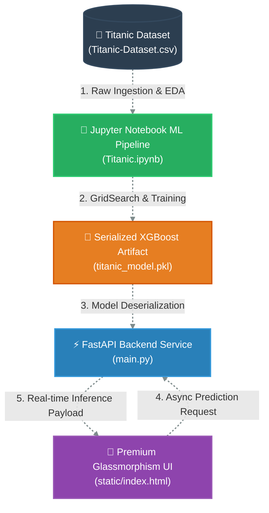

# 🚢 Titanic Survival Predictor
> **A fully integrated Machine Learning system to predict Titanic survival passenger fate with high-accuracy modeling and a premium web application interface.**

---

## 🌍 Project Overview

On April 15, 1912, the luxury passenger liner RMS Titanic sank after colliding with an iceberg, resulting in the tragic deaths of 1502 out of 2224 passengers and crew. This project analyzes the historical passenger manifest to discover patterns among survivors, building a high-accuracy predictive model using **XGBoost** and exposing it through a high-performance **FastAPI** web application with a stunning Glassmorphism design.

---

## 🛠️ Project Architecture & Data Flow

The system is engineered using a decoupled, high-performance three-tier architecture that separates data processing, service delivery, and interface representation:



### 🏛️ System Layers

#### 📊 1. Data Science & ML Pipeline (`Titanic.ipynb`)
Responsible for the core intelligence of the system.
* **EDA & Preprocessing**: Handles class balance verification, outlier mitigation, and missing value imputation.
* **Feature Engineering**: Constructs `AgeBand`, `FareBand`, `Title`, and unified `FamilySize` attributes.
* **Model Training**: Leverages a grid-search optimized **XGBoost Classifier** with Stratified 5-Fold Cross-Validation.
* **Serialization**: Dumps the calibrated model, custom label encoders, and feature scalers into a unified `joblib` pickle file.

#### ⚡ 2. Backend API Service (`main.py`)
A fast, asynchronous, type-safe API server constructed with **FastAPI**.
* **Data Validation**: Enforces request schema validation through **Pydantic** models.
* **Real-Time Inference**: Deserializes the XGBoost model at startup, processes input payloads, applies runtime scaling, and yields predictions in milliseconds.
* **Batch Processing**: Provides a `/predict/batch` endpoint supporting high-speed batch survival requests.

#### 🎨 3. Premium Web Interface (`static/`)
A highly responsive, beautifully designed Single Page Application (SPA).
* **Glassmorphism Design**: Features frosted background cards with custom HSL borders and modern typography.
* **Fluid Micro-Animations**: Employs CSS keyframe loops and active hover transitions for an interactive feel.
* **Responsive Fluidity**: Engineered using CSS Grid and Flexbox layouts, rendering beautifully on 4K monitors down to mobile screens.

---

## 📊 Feature Engineering & Dataset Prep

Advanced feature engineering was performed in the notebook to extract highly predictive features from the raw dataset, replacing low-value metadata:

| Feature Name | Type | Description | Transformation |
| :--- | :--- | :--- | :--- |
| **Pclass** | Categorical | Ticket class (1st, 2nd, 3rd) | Encoded & Scaled |
| **Sex** | Categorical | Passenger gender | Label Encoded (0: Female, 1: Male) |
| **Age** | Numerical | Fractional age of the passenger | Imputed with Median |
| **AgeBand** | Categorical | Age categorized into groups | `0: Child (0-12)`, `1: Teen (12-18)`, `2: Young Adult (18-35)`, `3: Adult (35-60)`, `4: Senior (60+)` |
| **Title** | Categorical | Title extracted from passenger names | Grouped into `Mr`, `Miss`, `Mrs`, `Master`, `Rare` |
| **FamilySize** | Numerical | Combined family count on board | `SibSp + Parch + 1` |
| **IsAlone** | Binary | Whether the passenger traveled solo | `1` if `FamilySize == 1` else `0` |
| **Fare** | Numerical | Passenger fare ticket price | Imputed with Median |
| **FareBand** | Categorical | Fare categorized into quartiles | 0 to 3 based on pandas `qcut` |
| **Embarked** | Categorical | Port of embarkation | `C: Cherbourg`, `Q: Queenstown`, `S: Southampton` |

### Key Preprocessing Strategies:
* **Handling Missing Values:** Missing ages and fares are filled with their median values to maintain robust statistics. Missing embarkation values are filled with the mode (`S`).
* **Title Extraction:** Extracted prefix titles (e.g., *Mr, Mrs, Miss, Master, Dr, Rev*) from names. Rare status titles were consolidated into `Rare` to prevent overfitting.
* **Data Leakage Protection:** Feature scaling using `StandardScaler` was fit strictly on the training partition and then applied to both train and test partitions.

---

## 📈 Model Performance & Hyperparameters

We leveraged the powerful **XGBoost Classifier** algorithm, which uses gradient boosted decision trees to achieve outstanding accuracy on tabular datasets.

### Hyperparameter Tuning:
Using `GridSearchCV` with 5-Fold Stratified Cross-Validation, the best hyperparameter configuration found was:
```python
{
    'colsample_bytree': 0.8,
    'learning_rate': 0.1,
    'max_depth': 5,
    'n_estimators': 200,
    'subsample': 1.0
}
```

### Evaluation Metrics:
* **Baseline CV Accuracy:** `81.89%`
* **Optimized GridSearch CV Accuracy:** `83.43%`
* **Holdout Test Set Accuracy:** `83.24%`

#### Classification Report (Test Set):
```text
              precision    recall  f1-score   support

Not Survived       0.85      0.88      0.87       110
    Survived       0.80      0.75      0.78        69

    accuracy                           0.83       179
   macro avg       0.83      0.82      0.82       179
weighted avg       0.83      0.83      0.83       179
```

* **Top Feature Importance:** The passenger's **Sex** is overwhelmingly the most dominant feature determining survival, followed by **Pclass** and **Passenger Title**, honoring the classic "women and children first" maritime protocol.

---

## 💻 Technical Stack & Specs

- **Machine Learning & Analysis:** Python, Jupyter Notebook, Pandas, NumPy, Scikit-Learn, XGBoost, Matplotlib, Seaborn, Joblib.
- **Backend API:** FastAPI, Uvicorn, Pydantic, CORS Middleware.
- **Frontend App:** Semantic HTML5, Vanilla CSS3 (Custom Glassmorphism theme, CSS Variables, Fluid Animations, Flexbox/Grid Layouts), Vanilla JavaScript (Async API calls, dynamic DOM manipulation, status-aware UI rendering).

---

## 🚀 Getting Started & Installation

Follow these steps to run the Titanic Survival Predictor on your local machine:

### 1. Prerequisites
Ensure you have Python 3.10+ installed.

### 2. Clone and Setup Environment
Navigate to the project root directory and create a virtual environment:
```bash
# Create virtual environment
python -m venv .venv

# Activate virtual environment (Windows)
.venv\Scripts\activate

# Activate virtual environment (Mac/Linux)
source .venv/bin/activate
```

### 3. Install Dependencies
Install all required libraries:
```bash
pip install fastapi uvicorn pandas numpy scikit-learn xgboost joblib pydantic
```

### 4. Run the Application
Launch the FastAPI production/development server:
```bash
python -m uvicorn main:app --reload --host 127.0.0.1 --port 8000
```

### 5. Access the System
- Open your browser and navigate to: **`http://127.0.0.1:8000`** to view the predictive interface.
- Open the interactive API Documentation (Swagger UI) at: **`http://127.0.0.1:8000/docs`** to test endpoints directly.

---

## 🗺️ API Endpoints Reference

### `GET /`
Serves the web client interface.

### `GET /health`
Returns system status (`{"status": "ok"}`).

### `GET /model/info`
Returns metadata about the serialized XGBoost model, features, and encoders.

### `POST /predict`
Evaluates survival metrics for a single passenger.
- **Payload Schema:**
```json
{
  "pclass": 3,
  "sex": "male",
  "age": 22.0,
  "title": "Mr",
  "family_size": 1,
  "fare": 7.25,
  "embarked": "S"
}
```
- **Response Schema:**
```json
{
  "survived": false,
  "survived_label": "Did not survive",
  "probability": 0.0984,
  "input_summary": { ... }
}
```

### `POST /predict/batch`
Accepts a JSON list containing up to 100 passengers to run automated batch predictions.

---

## 👨‍💻 Developer & Author

<p align="left">
  <b>Saged Amr</b><br>
  <i>Machine Learning & Full Stack Developer</i>
</p>

[](https://github.com/Saged00)
[](https://www.linkedin.com/in/saged-amr/)
